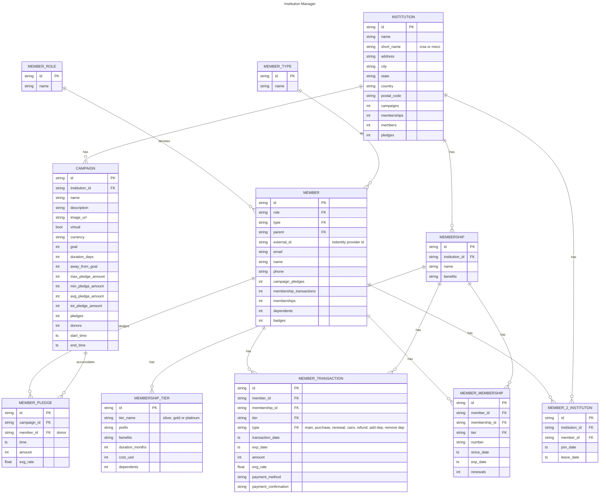
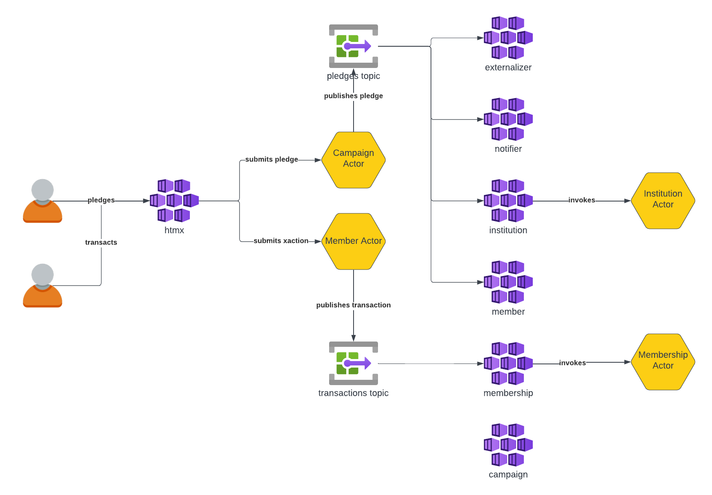

This is simple Go workspace to show how DAPR actors and pubsub services can be used in Go. 

A ficticious institution manager supports campaigns, memberships and members. Registered members (via an identity provider) can pledge to campaigns and sign up for memberships. 

## Data Model



## User Types

User Types or roles:
- Members as registers users (Google) with or without a membership
    - Parent, Spouse or Child members may not have identity provider ids
- Institution Managers as registered users (Google)
- Admins as registered users (Google)

**But how do we determine roles?**

## Source Code

Campaign manager source code is structured as go workspace which hosts the following modules:
- `externalizer` Microservice to handle externalization:
    - `pusher` service to externalize pledges to `pusher` 
- `notifier` Microservice to handle notification:
    - `notifier` service to externalize pledges via email
- `campaign` Microservice to handle campaign activities:
    - `campaign` actor and a dapr client to publish to a topic
- `institution` Microservice to handle institution activities:
    - `institution` actor and pledges topic handler to update actor  
- `member` Microservice to handle member activities:
    - `member` actor and pledges topic handler to update actor  
- `membership` Microservice to handle member activities:
    - `membership` actor and transactions topic handler to update actor  
- `htmx` Microservice to handle server-side rendering of HTML data:
    - DAPR client to communicate with actors
    - HTML Templates for pages and components
        - Campaigns => edit, watch and pledge
        - Institutions  => edit and watch
        - Pledges
    - `pusher` messages consumer
- `shared` Library to serve common code for the above modules

There are several actors:
- campaign
    - Receive Pledges
    - Reminder to update exchange rate
    - Timer to persist to external database
    - Timer to update external entities in real-time
    - Externalize pledges by publishing them on a topic
- institution
    - Receive Pledges
    - Timer to persist to external database
    - Timer to update external entities in real-time
- membership
- member

## User Interface

- HTMX for prototyping

## Platform

- DAPR Actors
- Azure Container Apps
    - Provides easy authentication for browser-based applications
- Terraform instead of Bicep
- AWS has App Runner but cannot do DAPR
    - Look into App Runner more
    - I don't see the concept of app that consists of multiple containers!
- DAPR Flows
- DAPR Pluggable components

## Technologies

- Pusher instead of SignalR to push messages
- CosmoDB or relational

## Tools

- [slides.com](https://slides.com/khaledhikmat)
- [Lucid Charts](https://help.lucid.co/hc/en-us/articles/11970952773652-Welcome-to-Lucidchart)
- [Mermaid](https://mermaid.js.org/syntax/entityRelationshipDiagram.html)
- Github Projects
- Github Wiki

## Things to do

- Coding:
    - Complete services
    - Allow member to push 
    - Member actor - Member Memberships
- Tools:
    - ~~Update AZ CLI~~
    - Deploy with containerapps
    - Investigate why VS Code Go workspace is not working
    - ~~Launch multiple `zsh` commands in background~~
- Source Code:
    - Observability
        - Logging
        - Tracing 
        - Metrics
    - Does Google offer OTEL collector?
    - Retrofit main to be preemptable
    - Retrofit to make `Daprservice` preemptable
    - ~~Retrofit for a single topic~~ 
    - Push to Github
- Configuration:
    - ~~Determine how to share a topic among 4 microservices with 4 different consumer groups~~
    - ~~Can I subscribe to a topic that is created by another DAPR service?~~
- Deployment:
    - Dockerfiles for Go
    - Pusher service
    - Deployment using the portal
    - Deployment using AZ CLI
    - Deployment using Bicep or Terraform
- Technologies:
    - [Azure Go SDK](https://github.com/Azure/azure-sdk-for-go/tree/main) is hopefully maintained. It looks pretty old with minor recent changes.
    - Database Choice
        - Cosmos has a Go SDK. But please see above.
        - AWS Dynamo has Go SDK
        - SQL Server has Go SDK that I am familiar with
        - SQL Server can be used as Actors storage
        - Postgres is also a good option as it exists everywhere
    - AWS App Runner
        - No DAPR Support
        - No good app communication
    - Azure Container Apps
        - Easy Authentication
        - DAPR Support
    - Pusher
- Pricing:
    - ACA seems to cost at least $60/month

## Containers



## Workspace

### Add Module

```bash
go work edit -use htmx
```

### Drop Module

```bash
go work edit -dropuse htmx
```

## Start and Stop

```bash
chmod 777 ./start.sh
chmod 777 ./stop.sh
# in one terminal session
./start.sh
# in another terminal session
./stop.sh
```

Please note the `stop-????` script has to be executed to avoid risking the DAPR srevice port be occupied. So u can have two terminals: one to start and one to stop.

## Actors

I noticed that the 1st actor invocation causes the following error...but it does seem to work anyway:

```
== APP == 2024/01/15 14:10:55 method GetStateManager is illegal, err = the latest return type actor.StateManagerContext of method "GetStateManager" is not error, just skip it
== APP == 2024/01/15 14:10:55 method ID is illegal, err = the latest return type string of method "ID" is not error, just skip it
== APP == 2024/01/15 14:10:55 method SetID is illegal, err = num out invalid, just skip it
== APP == 2024/01/15 14:10:55 method SetStateManager is illegal, err = num out invalid, just skip it
== APP == 2024/01/15 14:10:55 method Type is illegal, err = the latest return type string of method "Type" is not error, just skip it
```

Do not really like this....but this is how it is currently working.

## Redis cli

Access Docker CLI:

```bash
docker exec -it dapr_redis redis-cli
```

- Clean Redis: 
```bash
FLUSHALL
```

- Make sure:
```bash
KEYS *
```

- Get key value:
```bash
HGET campaign-manager-core||CampaignActorType||1000||main data
```

If running in k8s, do `docker ps` to discover the container name of the REDIS running in K8s. and then do the above docker command:

```bash
docker exec -it k8s_redis_redis-75db659ddc-q6jfn_dapr-storemanager_b116ad62-7b4e-4a75-968f-39f84ce8a16c_0 redis-cli
```

